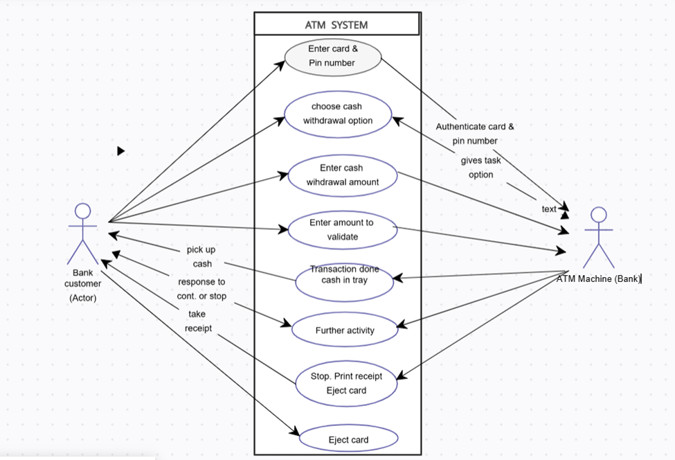

# Object-Oriented Analysis and Design (OOAD) Overview

## 1. Definition the following terms:

### i. Object-Oriented Analysis (OOA)

Object-Oriented Analysis is the process of understanding and modeling a system using objects. It focuses on identifying key entities, their relationships, and behaviors to create a blueprint for system development.

### ii. Object-Oriented Design (OOD)

Object-Oriented Design takes the analysis models and transforms them into a detailed system architecture. It defines object interactions, data structures, and software components needed for implementation.

### iii. Object-Oriented Programming (OOP)

Object-Oriented Programming is the actual implementation of the system using an object-based approach. It utilizes classes and objects, encapsulation, inheritance, and polymorphism to write efficient and reusable code.

## 2. Highlight the Primary Tasks in Object-Oriented Analysis

- **Identifying Objects:** Recognizing real-world entities that play a role in the system.
- **Defining Attributes and Behaviors:** Listing characteristics (attributes) and actions (methods) of objects.
- **Establishing Relationships:** Mapping how objects interact with each other.
- **Creating a Conceptual Model:** Visual representation of objects and their interactions.

## 3. Describe The Object Model

The object model represents a system based on objects and their relationships. It focuses on encapsulation, inheritance, polymorphism, and abstraction to create modular and reusable components.

## 4. Differentiate Between the Following Terms in OOAD

### i. Generalisation vs. Specialisation

- **Generalisation:**

  - Extracts shared characteristics from multiple classes to create a more generic superclass.
  - Example: A `Vehicle` superclass generalizing `Car` and `Bike`.
  - Promotes code reusability and avoids redundancy.

- **Specialisation:**

  - The process of creating more specific subclasses from a general class by adding unique attributes or behaviors.
  - Example: A `SavingsAccount` class being a specialized version of an `Account` superclass.
  - Enhances flexibility by extending base class functionality.

### ii. Aggregation vs. Composition

- **Aggregation:**

  - A relationship where an object can exist independently of the container object.
  - Example: A university and its students (students can exist without the university).
  - Represented as a hollow diamond in UML diagrams.

- **Composition:**

  - A strong relationship where objects depend on each other for existence.
  - Example: A car and its engine (an engine is part of the car and cannot exist independently).
  - Represented as a filled diamond in UML diagrams.

## 5. Explain and Give Examples of the Three Types of Cardinality Ratios of Associations

- **One-to-One (1:1):**

  - A single entity is associated with exactly one other entity.
  - Example: A passport and its holder.

- **One-to-Many (1**\*\*:M\*\*\*\*)

  - One entity relates to multiple other entities.
  - Example: A teacher and students.

- **Many-to-Many (M**\*\*:M\*\*\*\*)

  - Multiple entities associate with multiple others.
  - Example: Students enrolling in multiple courses.

## 6. Discuss Any Three Measures of System Quantity

- **Scalability:** The ability to handle growth efficiently.
- **Performance:** The speed and responsiveness of the system.
- **Maintainability:** The ease of updating or modifying the system.

## 7. Highlight and Briefly Explain Four Elements Found in a State Machine Diagram

- **States:** The various conditions an object can be in.
- **Transitions:** The movement from one state to another.
- **Events:** Triggers that cause state changes.
- **Actions:** Operations performed during transitions.

## 8. Define the Following Terms as Used in OOAD

### i. Abstraction

Hiding complex details and showing only essential features (e.g., a car dashboard hides internal mechanisms).

### ii. Encapsulation

Bundling data and methods together while restricting direct access (e.g., private attributes in a class).

### iii. Polymorphism

Allowing the same method to behave differently depending on the object (e.g., a `draw()` method for different shapes).

## 9. Discuss Five Benefits of Using Object-Oriented Analysis in a Bank ATM System

- **Modularity:** Improves code reuse and maintenance.
- **Scalability:** Adapts easily to new banking features.
- **Security:** Protects customer data through encapsulation.
- **Flexibility:** Supports various customer transactions.
- **Real-World Mapping:** Models customers and transactions naturally.

## 10. Design a Use Case Diagram for an ATM System

### Key Elements:

- **Actors:** Customer, ATM System, Bank Database.
- **Use Cases:** Withdraw Cash, Deposit Money, Transfer Funds, Check Balance, Print Receipt.
- **Relationships:**
  - Customer interacts with all use cases.
  - ATM System communicates with the Bank Database for transactions.

## 11. Differentiate Between Object-Oriented Analysis and Structured Analysis

- **Object-Oriented Analysis (OOA):**

  - Focuses on objects, encapsulation, and relationships.
  - Uses UML diagrams like class diagrams, use case diagrams, etc.
  - More suited for complex systems with reusable components.

- **Structured Analysis:**

  - Uses processes and data flow models (DFDs).
  - Focuses on functions rather than objects.
  - Works best for simple, sequential systems.

## 12. Differentiate Between Iterative and Incremental Development Processes

- **Iterative Development:**

  - Develops a rough version of the system and refines it in multiple cycles.
  - Example: Agile methodology.

- **Incremental Development:**

  - Builds the system in small functional parts over time.
  - Example: Adding features step by step, each functioning independently.

## 13. Explain These Three Techniques Used in Gathering Requirements

- **Interviews:** One-on-one discussions with stakeholders.
- **Surveys:** Collecting structured responses from users.
- **Prototyping:** Building early models to clarify requirements.

## 14. State Three Features of Message Passing

- **Encapsulation:** Ensures data security.
- **Dynamic Binding:** Enables flexible method execution.
- **Loose Coupling:** Reduces dependencies between objects.

## 15. Explain the Purpose of Component and Deployment Diagrams in Modeling a Software System

- **Component Diagram:** Shows the physical structure of software components.
- **Deployment Diagram:** Maps software to hardware for execution.

